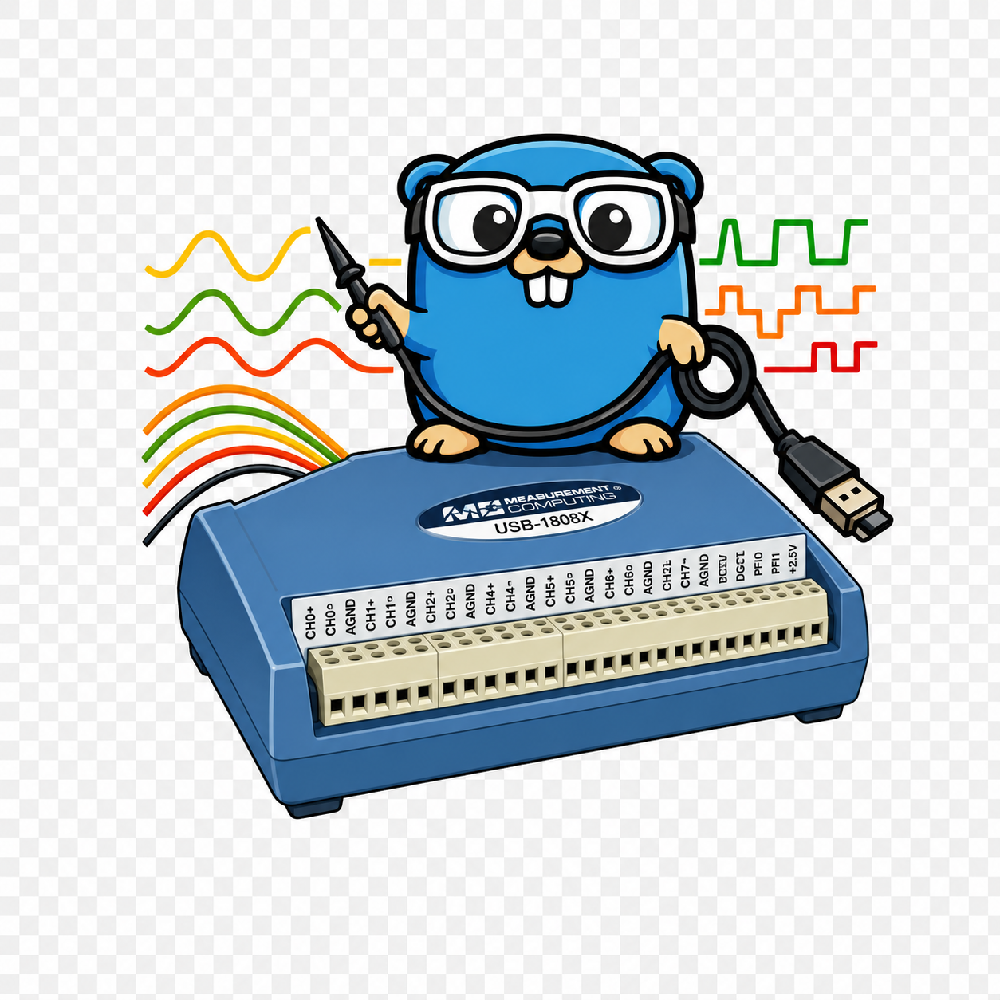

# mcc-usb-1808



[](https://pkg.go.dev/github.com/borud/mcc-usb-1808)

This library helps you write applications that interface with the Measurement [Computing Corporation USB 1808 and 1808X](https://digilent.com/shop/mcc-usb-1808x-high-speed-high-precision-simultaneous-usb-daq-device/) DAQs.

## Prerequisites

- Go 1.24+
- libusb 1.0 (`brew install libusb` on macOS, `apt install libusb-1.0-0-dev` on Debian/Ubuntu)

## Installation

```sh
go get github.com/borud/mcc-usb-1808
```

## Quick Start

```go
package main

import (
    "fmt"
    "log"

    "github.com/borud/mcc-usb-1808"
)

func main() {
    dev, err := usb1808.Open()
    if err != nil {
        log.Fatal(err)
    }
    defer dev.Close()

    if err := dev.Init(); err != nil {
        log.Fatal(err)
    }

    // Configure all channels for ±10V differential.
    configs := make([]usb1808.AnalogInChannelConfig, usb1808.NumAInChannels)
    for i := range configs {
        configs[i] = usb1808.AnalogInChannelConfig{
            Channel: i,
            Range:   usb1808.BP10V,
            Mode:    usb1808.Differential,
        }
    }
    if err := dev.ConfigureAnalogIn(configs); err != nil {
        log.Fatal(err)
    }

    volts, err := dev.AnalogIn()
    if err != nil {
        log.Fatal(err)
    }
    for i, v := range volts {
        fmt.Printf("CH%d: %+9.4f V\n", i, v)
    }
}
```

## CLI Tool

A command-line tool is included for quick testing. Install it with:

```sh
go install github.com/borud/mcc-usb-1808/cmd/daq@latest
```

Example usage:

```sh
daq info                                                # Device info
daq blink --count 5                                     # Blink LED
daq analog read --range bp10v                           # Single read (±10V)
daq analog scan --channels 0-3 --rate 10000 --count 100 # Continuous scan
```

## Documentation

See the [docs/](docs/README.md) directory for the full manual:

- [Getting Started](docs/getting-started.md)
- [Analog Input](docs/analog-input.md)
- [Analog Output](docs/analog-output.md)
- [Digital I/O](docs/digital-io.md)
- [Counters and Encoders](docs/counters-encoders.md)
- [Timers](docs/timers.md)
- [Triggers](docs/triggers.md)
- [Calibration](docs/calibration.md)
- [Capture](docs/capture.md)
- [CLI Tool](docs/cli.md)
- [Errors](docs/errors.md)
