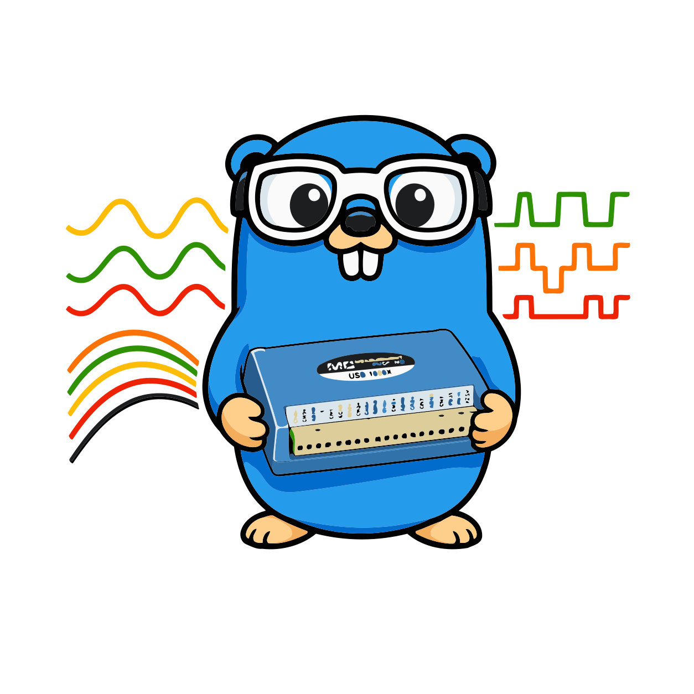

# mcc-usb-1808



[](https://pkg.go.dev/github.com/borud/mcc-usb-1808)

This library helps you write applications that interface with the Measurement [Computing Corporation USB 1808 and 1808X](https://digilent.com/shop/mcc-usb-1808x-high-speed-high-precision-simultaneous-usb-daq-device/) DAQs.

## Prerequisites

- Go 1.24+
- libusb 1.0 (`brew install libusb` on macOS, `apt install libusb-1.0-0-dev` on Debian/Ubuntu)

## Installation

```sh
go get github.com/borud/mcc-usb-1808/v4
```

## Quick Start

```go
package main

import (
    "fmt"
    "log"

    "github.com/borud/mcc-usb-1808/v4/device"
)

func main() {
    dev, err := device.Open()
    if err != nil {
        log.Fatal(err)
    }
    defer dev.Close()

    if err := dev.Init(); err != nil {
        log.Fatal(err)
    }

    // Scan 4 analog channels at 10 kHz.
    cfg := device.ScanConfig{
        Channels: []device.ChannelConfig{
            {Index: 0, Type: device.ChannelTypeAnalog, Range: device.BP10V, Mode: device.Differential},
            {Index: 1, Type: device.ChannelTypeAnalog, Range: device.BP10V, Mode: device.Differential},
            {Index: 2, Type: device.ChannelTypeAnalog, Range: device.BP10V, Mode: device.Differential},
            {Index: 3, Type: device.ChannelTypeAnalog, Range: device.BP10V, Mode: device.Differential},
        },
        Rate: 10000,
        Count: 100,
    }

    h, err := dev.CreateScan(cfg)
    if err != nil {
        log.Fatal(err)
    }
    if err := h.Start(); err != nil {
        log.Fatal(err)
    }
    for chunk := range h.Chunks() {
        fmt.Printf("received %d bytes\n", len(chunk))
    }
    h.Stop()
}
```

## CLI Tool

A command-line tool is included for quick testing. Install it with:

```sh
go install github.com/borud/mcc-usb-1808/v4/cmd/daq@latest
```

Example usage:

```sh
daq info                                             # Device info
daq blink --count 5                                  # Blink LED
daq capture --channels analog --rate 10k             # Capture all 8 analog channels
daq capture --channels ain0-ain3:bp10v:diff,dio      # Mixed channel spec
daq bench --channels analog --rate 200k --duration 10 # Benchmark throughput
```

## Documentation

See the [docs/](docs/README.md) directory for the full manual:

- [Getting Started](docs/getting-started.md)
- [Analog Input](docs/analog-input.md)
- [Calibration](docs/calibration.md)
- [Capture](docs/capture.md)
- [CLI Tool](docs/cli.md)
- [High-Rate Capture](docs/high-rate-capture.md)
- [Errors](docs/errors.md)

## If you use this

If you use this it would be really nice if you dropped me a line to let me know, or sent a PR so I can include a link to your application below.
